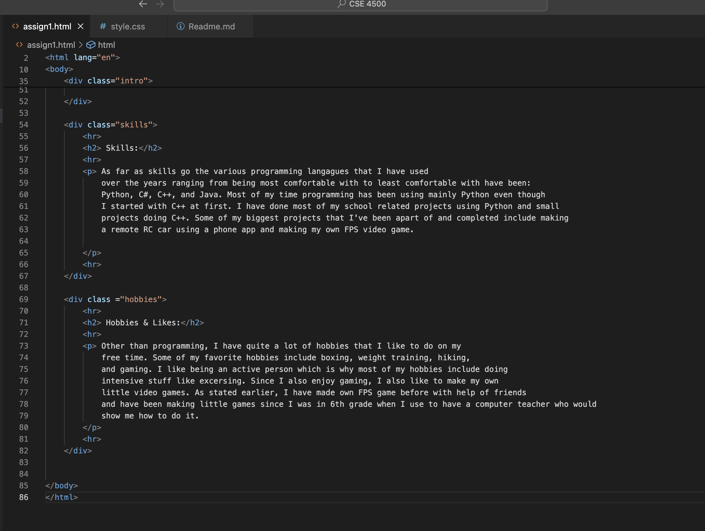
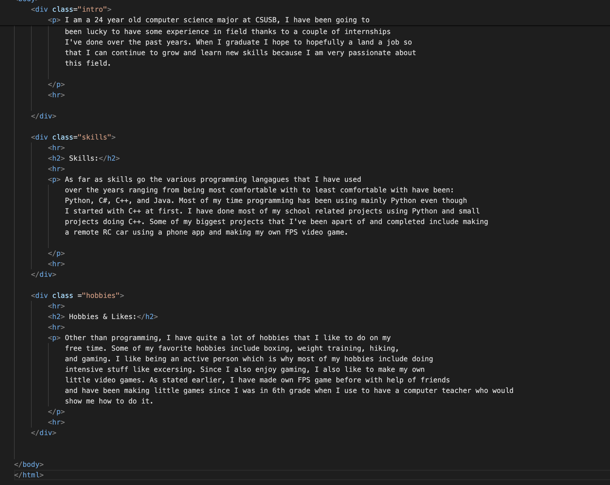
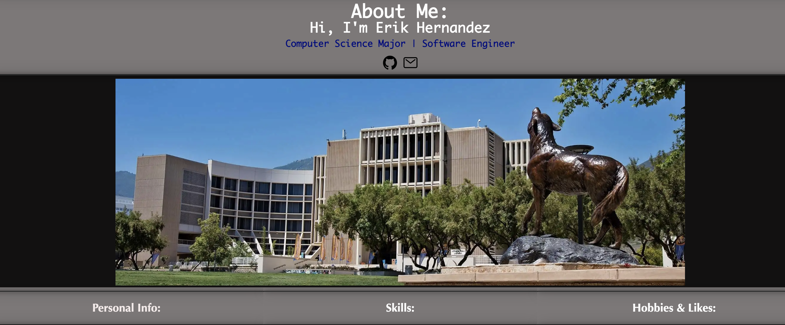
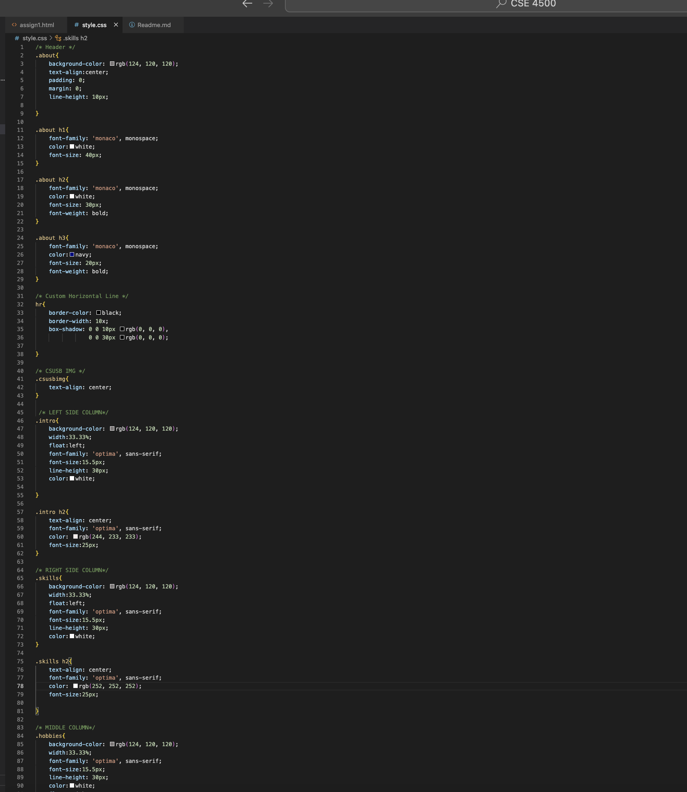
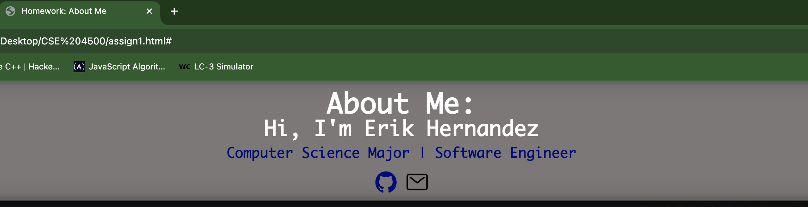
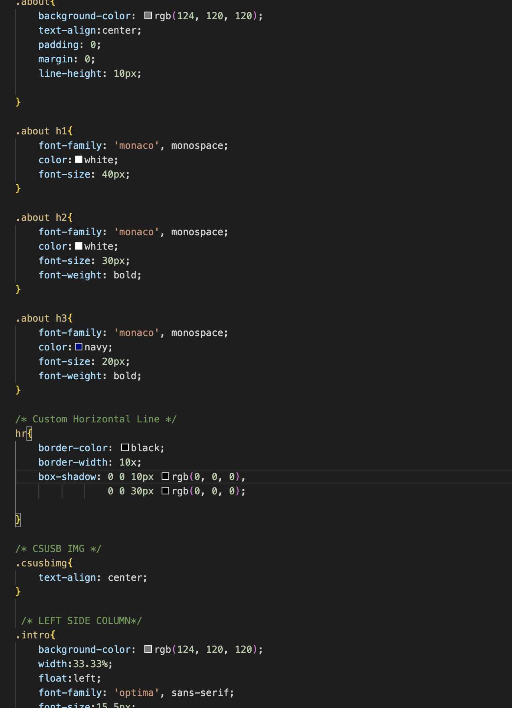

# About Me

PROVIDE OVERVIEW OF ASSIGNMENT HERE

Time spent: **NUMBER_HOURS_SPENT** hours spent in total

## Features

The following **required** features are completed:

- [X] Modifies title in head so that the tab has a unique name, (e.g. About Me). (1pts)
- [X] Uses a mix of headers, paragraphs, and div's. (3pts)
- [X] Includes at least 3 paragraphs. (3pts)
- [X] Includes at least one image. (2pts)
- [X] Includes a .css file to style with at least 4 ways to format the elements in the html. (3pts)
- [X] Includes a link that directs to your Github account (can be main account or specifically to your Platform_Computing Repo). (3pts)

The following **bonus** features are implemented:

- [X] Applies different font(s). (0.5 pt)
- [X] Applies border and margins. (0.5 pt)
- [X] DESCRIBE ANY OTHER FEATURES HERE. - Social Media Logo Link Buttons

## Screenshot and/or Video Walkthrough

## Notes:
PROVIDE RELEVANT OR ADDITIONAL INFORMATION HERE. Below are formatting options to add emphasis in text
<ul>
  <li>**Example in bold**</li>
  <li>*Example in italics*</li>
</ul>
